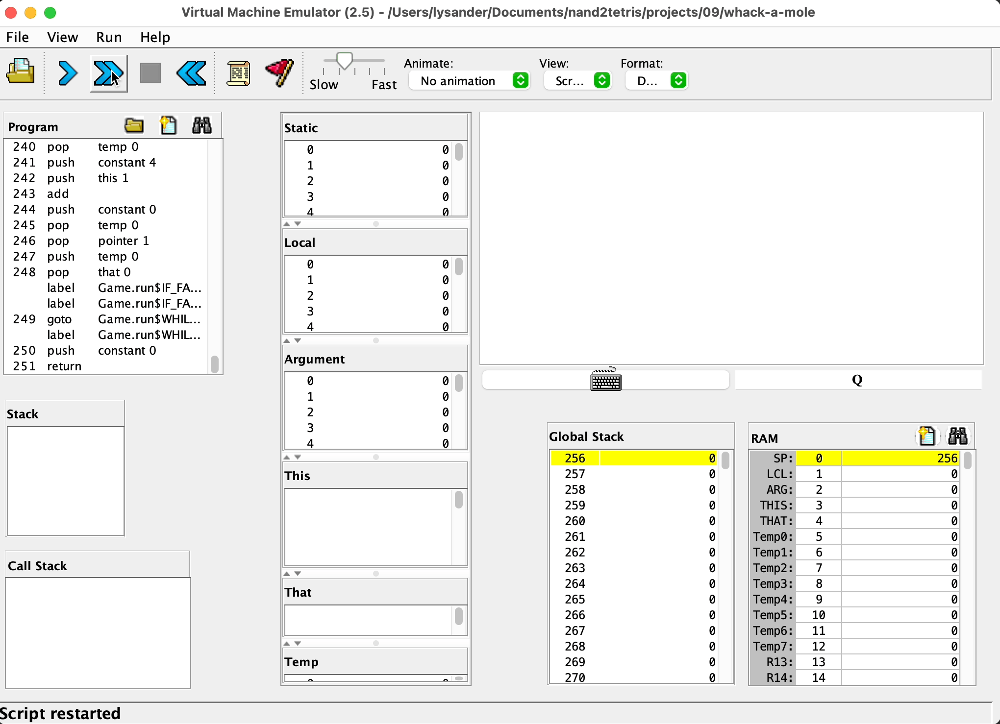

# Whack a Mole!

Hello everyone! Welcome to the Whack a Mole game! Enjoy yourself and don't forget to give it a grade!

---

## How to play

1. Open the VM translator in the `tools` folder.
2. Load the `WhackAMole` directory.
3. Choose `No animation` in the combobox titled `Animate`.
4. Choose the speed you like between `Slow` and `Fast`.
5. Click the `Run` button, which is a `>>` icon.

## Keyboard shortcuts

- `1` ~ `5`. strike the mole.
- `q`. quit the game.

## Demo

